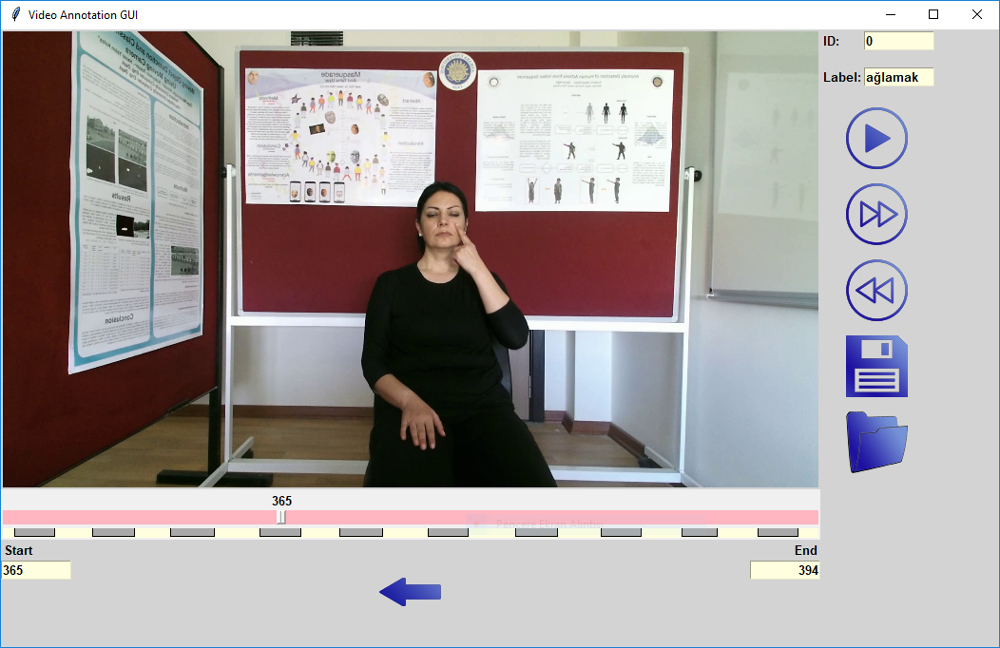

========================
Sign Annotation Tool Kit
========================

Sign Annotation software that is used to cut and annotate the data files. Every file recorded with :doc:`./signrecorder` will contain five differen data ,i.e. RGB, Depth, User index, Infrared, Skeletal, and this application will cut the needed parts, labels them and save them as isolated video samples.

Requirements
--------------------

 - Python 3
 - OpenCV
 - Tkinter
 - Numpy

Usage
--------

**Main Window**

    *Sign Annotation Tool Kit Screenshot*

To be able to use the application, we need to choose the RGB file from the source dataset firstly. Software will generate recommendation frame ids for cutting.

 * play button will show the chosen isolated sample part.
 * next and previous buttons are for changing between these recommened isolated parts.
 * save icon will write the chosen isolated sample to new dataset directory.
 * arrow under the frame there to choose between start and end frame ids after choosing with the help of the curser or directly entering the values to start and end points will change the lenght of chosen sample.

