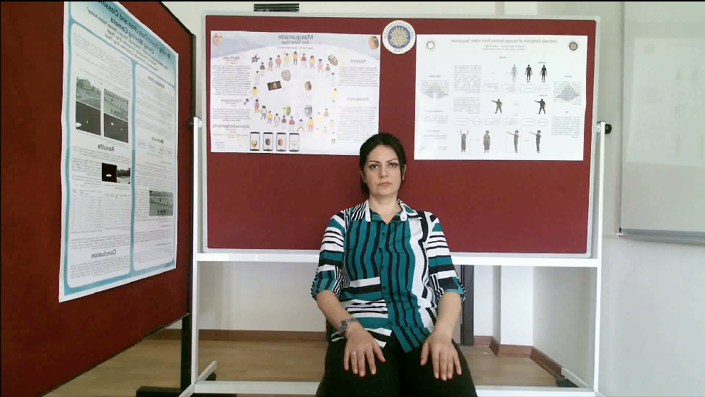

.. highlight:: python

================
Sign Data Loader
================

Sign data loader is a helper script for the generalized use of the created TSL dataset. It is created to make loading a data sample from disk easier.

Requirements
--------------------
 - Python 3
 - OpenCV
 - Numpy
 - Pandas

Usage
-----------
To be able to use it

1. import the class; ::

    import signdataloader as loader

2. call the needed function with the desired parameters; ::    

    loader.get_frame(user_id, sign_id, rep_id, frame_id)

For example this function will return depth and RGB frame of the correponding sample from the dataset.

.. table:: Returned Images
   :align: center

   +---------+---------+
   | |color| | |depth| |
   +---------+---------+
   |   RGB   |  Depth  |
   +---------+---------+

