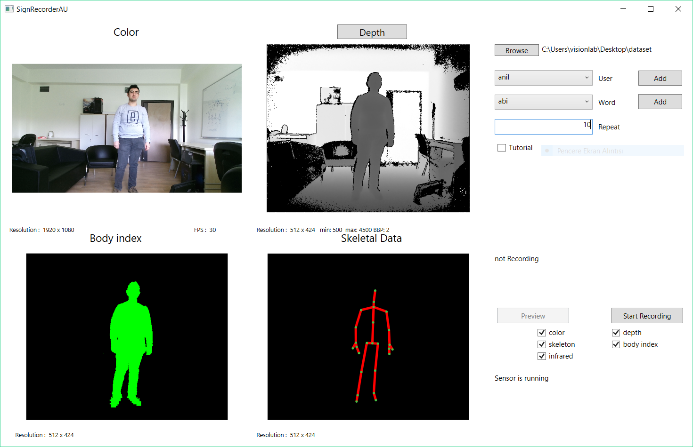
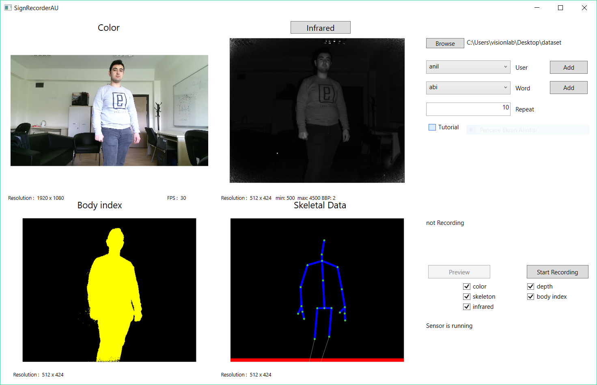
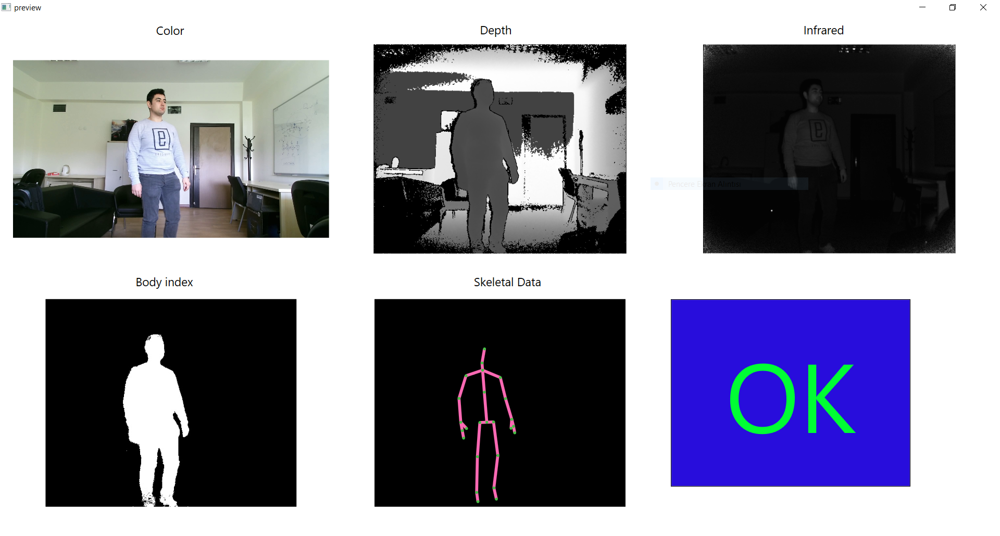

==============
Sign Recorder
==============

Video Recorder Software for Turkish Sign Language (TSL) with Kinect v2. Created and used for recording Turchish Sign language dataset samples. Kinect v2 generates two raw and three processed data. The raw data is infrared and RGB frames and processed ones are depth, user index and skeletal data.

 * When there is sufficiant light in the enviroment device can work with 30 fps otherwise the fps will drop to 15. 
 * HD RGB video frame's size is 1920 x 1080.
 * Infrared video frame's size is 512 x 424. Because of the generation of the processed data is done by Kinect SDK from infrared data, this size is also the size of all of processed data (depth, user index, skeletal). 
 

Requirements
--------------------

 #. Kinect SDK `original site <https://www.microsoft.com/en-us/download/details.aspx?id=44561>`__
 #. visual studio 2012 or 2013 `original site <https://visualstudio.microsoft.com/>`__
 #. (optianal) `DirectX SDK <https://www.microsoft.com/en-us/download/details.aspx?id=6812>`__
 #. Kinect v2 sensor
 #. USB 3.0 for kinect sensor

Kinect v2 sensor and SDK needs
-------------------------------

1. Supported operating systems of kinect v2 SDK
    - Windows 8 (x64),  Windows 8 Embedded Standard (x64)
    - Windows 8.1 (x64), Windows 8.1 Embedded Standard (x64)
2. Recommended hardware
    - 64 bit (x64) processor
    - 4 GB Memory (or more)
    - I7 3.1 GHz (or higher)
    - Built-in USB 3.0 host controller
    - DX11 capable graphics adapter
3. Useful links
    - DirectX SDK : `link <https://www.microsoft.com/en-us/download/details.aspx?id=6812>`__
    - DirectX End-User Runtimes : `link <https://www.microsoft.com/en-us/download/details.aspx?id=8109>`__
    - Kinect v2 SDK documentaion : `link <https://docs.microsoft.com/en-us/previous-versions/windows/kinect/dn799271(v%3dieb.10)>`__
    - Kinect tutorials : `link <http://kinect.github.io/tutorial/lab01/index.html>`__

Used Libraries
----------------
 #. Accord
 #. Accord.Video
 #. Accord.Video.FFMPEG
 #. CsvHelper
 #. KinectSDK

This libraries used to develop the application and when opening the solution with Visiual Studio will gether them.

Usage
--------

**1. Main Window**

    *Main window depth frame open*

    *Main window infrared frame open*

Application opens with this window to be able to start recording 3 things needed to be done:

 1. Choose dataset destination directory. This will contain all the files created by the application.
 2. If it is first time use adding user name otherwise user can be chosen from the drop-down menu if it is added beforehand.
 3. Giving a repetion number. This is not a crutial information but because of later (e.g. :doc:`./signannotation`) use it is needed. 

After doing all of that record button will be activated. Record button click will start recording and recorded frame count can be followed for all data channels.

**2. Preview Window**

    *Preview window*

Preview windows only opens when preview button clicked on the main window. Last recorded data will play in this area. Main reason of this window is need of data validation.

