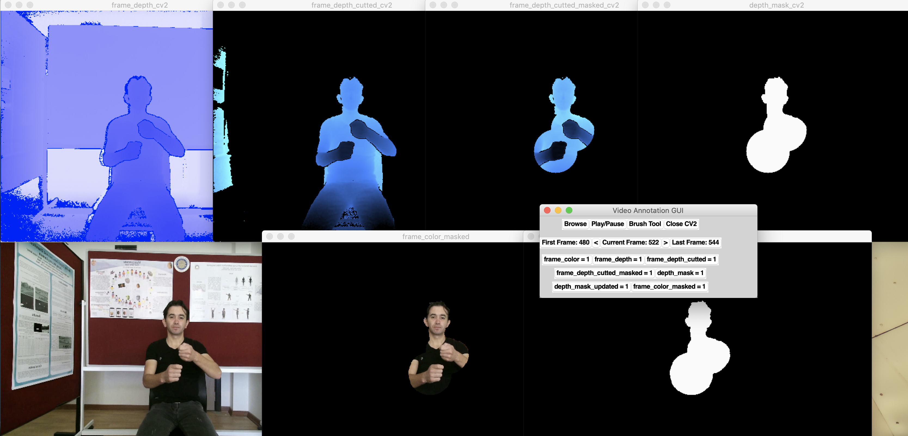

=================
Sign Segmentation
=================

Segmentation tool to generate segmentate hands and head of the user. Application will generate binary mask to be used to split desired parts of the data. 

Requirements
--------------------
 - Python 3
 - OpenCV
 - Tkinter
 - Numpy
 - Pandas

Usage
--------------------

    *Sign Segmentation Tool Screenshot*

When the application is opened to start generating segmentaion mask, desired RGB sample should be chosen with browse button. After that the recommended masks for RGB and Depth data will be generated.

 * with the help of the play\pause button masks and data can be observed.
 * if there is a need for change it can be done with the brush tool.
 * to navigate through frames with the arrow buttons.
