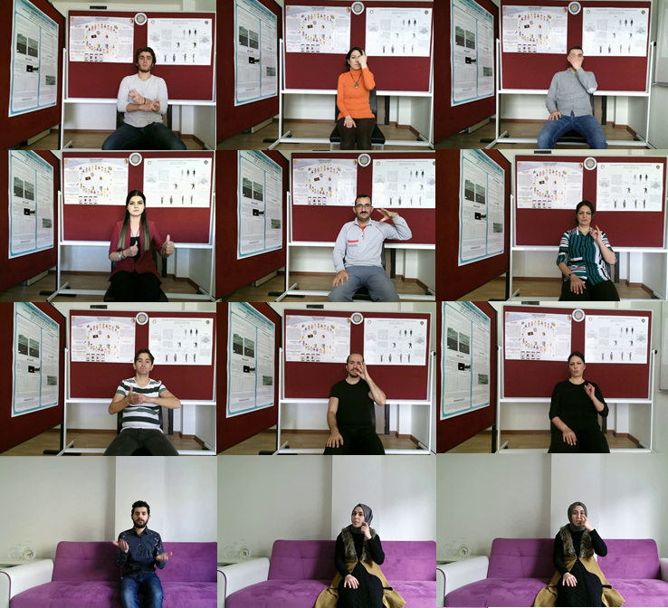

===================
Dataset Description
===================

Created dataset is recorded with the help of :doc:`./applications/signrecorder` software.

Dataset properties
-------------------
 * 228 words are recorded with general use and challenging factors in mind.
 * We recorded our videos in 5 differnt modalities (i.e. HD RGB, Depth, Infrared, Skeletal, User mask) from Microsoft Kinect V2.
 * Our signers consist of 6 sign language mentors, one deaf person and 5 trained signers. In total 12 people.
 * Each sign is recorded with 10 repetitions, professional signers also provided 10 repetitions wearing black clothes.
 * 228 words :math:`\times \sim` 150 samples :math:`\approx` 34.200 sample videos

The signs in the TSL corpus is divided into 7 categories:
 * 1.group, has no occlusion, crossing or contact with other body parts and includes 63 words.
 * 2.group, hands can occlude each other or contact can occur between the hands and includes 52 words.
 * 3.group, hands can occlude face of the signer or can touch it and includes 58 words.
 * 4.group, contains crossing hands and occlusions can occure. It includes 14 words.
 * 5.group, depth information is essential. It includes 22 words.
 * 6.group, compound words consists of words that has more than one sign in it and includes 19 words.
 * 7.group, similar signs and it is specially challening because of similar sign patterns.

   TSL dataset samples

..
    .. table:: Example Frames From Dataset
       :align: center

       +---------+---------+
       | |color| | |depth| |
       +---------+---------+
       |   RGB   |  Depth  |
       +---------+---------+

    .. |color| image:: images/color_image.png
       :scale: 60 %

    .. |depth| image:: images/depth_image.png
       :scale: 60 %

