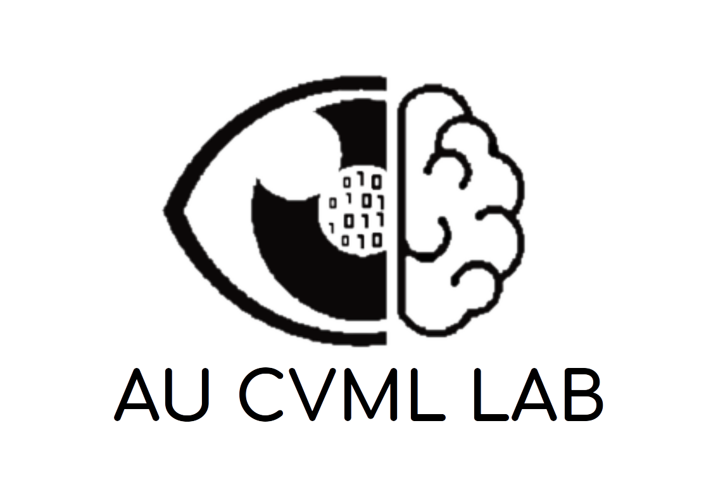

.. AU CVML LAB Turkish Sign Language Recognition Project's documentation master file, created by
   sphinx-quickstart on Sun May 26 12:34:20 2019.
   You can adapt this file completely to your liking, but it should at least
   contain the root `toctree` directive.

========================================================================================
AU CVML LAB TSL Recognition Project's documentation
========================================================================================

.. image:: ./images/lab_logo.png
   :scale: 20 %
   :align: center

Ankara University Computer Vision & Machine Learning Labaratory (CVML LAB) Turkish Sign Language (TSL) Recognition Project's documentation

for more information, go to AU CVML LAB's website `click here <https://cvml.ankara.edu.tr>`__.

.. toctree::
   :maxdepth: 2
   :caption: Contents:

   introduction
   starting
   applications
   dataset

.. Indices and tables
   ==================

   * :ref:`genindex`
   * :ref:`search`
   * :ref:`modindex`.

|logo| 

